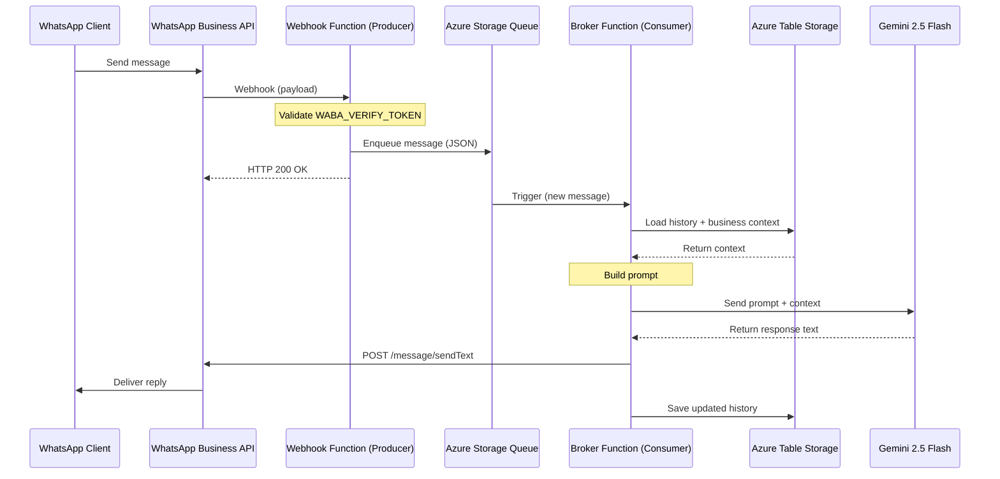
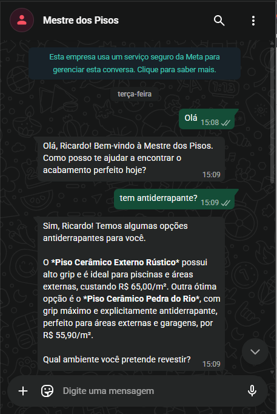

🇺🇸 English | 🇧🇷 [Português](README.pt-br.md)

# Anddo Assistant (Public)

[](https://github.com/andre-r-magalhaes/anddo-assist-public/actions/workflows/main_anddo-backend-fnc.yml)
[](LICENSE)
[](https://www.python.org/)

A serverless WhatsApp assistant that integrates the WhatsApp Business API, Azure Functions, and Google Gemini to answer customer questions with business context — built as a portfolio-grade demonstration of production-style architecture, not a toy script.

## Objective

This project processes messages received via WhatsApp webhook, queues them asynchronously in Azure, enriches them with business context (catalog, conversation history), generates a response with Gemini, and replies back through WhatsApp Business API.

## Architecture

The flow decouples the webhook (fast, stateless) from the actual processing (context lookup + LLM call), using a queue in between — so a slow AI response never blocks the webhook or risks WhatsApp retry timeouts.



## See It In Action

An example conversation with a fictional flooring & tile retailer ("Mestre dos Pisos"), showing the assistant answering a product question using catalog context (item, price, and use-case fit) rather than a generic reply:



## Tech Stack

- Python
- Azure Functions
- Azure Storage Queue
- Azure Table Storage
- Google Gemini API
- WhatsApp Business API

## Project Structure

```
adapters/   # External integrations (WhatsApp, Gemini, storage)
core/       # Business logic and orchestration
data/       # Data access layer
models/     # Domain models / DTOs
tests/      # Unit and integration tests
utils/      # Shared helpers
```

## Prerequisites

- Python 3.12
- A Google Cloud account with access to the Gemini API
- An Azure account with access to Azure Functions and Azure Storage
- A Meta account with access to the WhatsApp Business API

## Installation

1. Clone the repository:

```bash
git clone https://github.com/andre-r-magalhaes/anddo-assist-public.git
cd anddo-assist-public
```

2. Install dependencies:

```bash
pip install -r requirements.txt
```

## Configuration

Create a `.env` file at the project root based on `.env.example` and fill in the required environment variables. Export them before running the project:

```bash
export $(grep -v '^#' .env | xargs)
```

## Running Tests

```bash
pytest
```

**Test types:**
- **Unit tests** — no external credentials required; run fully locally.
- **Gemini integration tests** — require the `GOOGLE_API_KEY` environment variable; skipped automatically if it's not set.

> **Note:** part of the current test suite is still legacy scripts rather than proper pytest functions. They're being converted incrementally — treat the suite as a work in progress, not full coverage yet.

## Known Limitations

- The WABA version must be compatible with the current implementation.
- The Gemini API key must be valid and have sufficient quota.

## Project Status

This is a portfolio demonstration project and is not running in production. It serves as an example of integrating messaging services with generative AI.

## Security

- Never commit credentials or tokens to the repository.
- Configure secrets in the deployment environment.
- Validate the Meta webhook signature before using this in production.
- Avoid logging personal data.
- Deployment is not automated in this portfolio repository.

## Contributing

Feel free to open issues and pull requests.

## License

This project is licensed under the MIT License.
