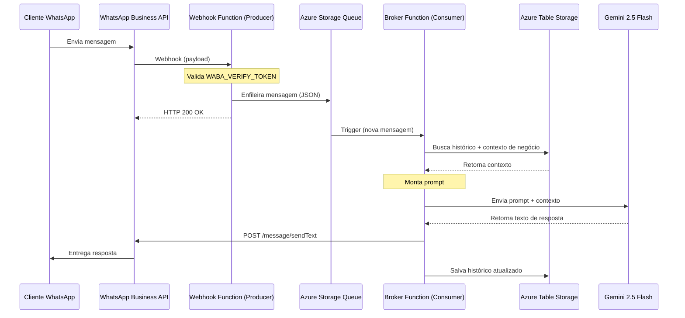

🇧🇷 Português | 🇺🇸 [English](README.md)

# Anddo Assistant Public

## Objetivo

Este projeto é um assistente de integração entre a WhatsApp Business API (WABA) e o modelo Gemini da Google. Ele processa mensagens recebidas via webhook, envia para uma fila Azure, processa com o modelo Gemini e responde via WABA.

## Arquitetura

O fluxo separa o webhook (rápido, sem estado) do processamento real (busca de contexto + chamada ao LLM), usando uma fila no meio — assim uma resposta lenta da IA nunca trava o webhook nem arrisca timeout de retry do WhatsApp.



## Veja Funcionando

Exemplo de conversa com uma loja fictícia de pisos e porcelanatos ("Mestre dos Pisos"), mostrando o assistente respondendo com contexto real de catálogo (produto, preço e adequação de uso) em vez de uma resposta genérica:


## Tecnologias

- Python
- Azure Functions
- Azure Storage Queue
- Azure Table Storage
- Google Gemini API
- WhatsApp Business API

## Estrutura do Projeto

```
adapters/   # Integrações externas (WhatsApp, Gemini, storage)
core/       # Lógica de negócio e orquestração
data/       # Camada de acesso a dados
models/     # Modelos de domínio / DTOs
tests/      # Testes unitários e de integração
utils/      # Utilitários compartilhados
```

## Pré-requisitos

- Python 3.12
- Conta na Google Cloud com acesso ao Google Gemini API
- Conta na Azure com acesso ao Azure Functions e Azure Storage
- Conta na Meta para acesso à WhatsApp Business API

## Instalação

1. Clone o repositório:

```bash
git clone https://github.com/andre-r-magalhaes/anddo-assist-public.git
cd anddo-assist-public
```

2. Instale as dependências:

```bash
pip install -r requirements.txt
```

## Configuração

Crie um arquivo `.env` na raiz do projeto com base no `.env.example` e preencha as variáveis de ambiente necessárias. Exporte as variáveis de ambiente antes de executar o projeto:

```bash
export $(grep -v '^#' .env | xargs)
```

## Executando Testes

```bash
pytest
```

**Diferenciação de testes:**
- **Testes Unitários** — não dependem de credenciais externas e podem ser executados localmente.
- **Testes de Integração com Gemini** — dependem da variável de ambiente `GOOGLE_API_KEY` e são marcados como testes de integração. São pulados se a variável não estiver configurada.

> **Nota:** parte da suíte atual ainda é composta por scripts legados em vez de funções pytest propriamente ditas. Estão sendo convertidos aos poucos — trate a suíte como trabalho em andamento, ainda sem cobertura completa.

## Limitações Conhecidas

- A versão do WABA deve ser compatível com a implementação atual.
- A chave da API do Google Gemini deve ser válida e ter cotas suficientes.

## Status do Projeto

Este projeto é um portfólio demonstrativo e não está em produção. Ele serve como exemplo de integração entre serviços de mensagens e IA generativa.

## Segurança

- Nunca comite credenciais ou tokens no repositório.
- Configure secrets no ambiente de deploy.
- Valide a assinatura do webhook da Meta antes de usar em produção.
- Evite registrar dados pessoais nos logs.
- O deploy não é executado automaticamente neste repositório de portfólio.

## Contribuição

Sinta-se à vontade para abrir issues e pull requests.

## Licença

Este projeto está licenciado sob a Licença MIT.
